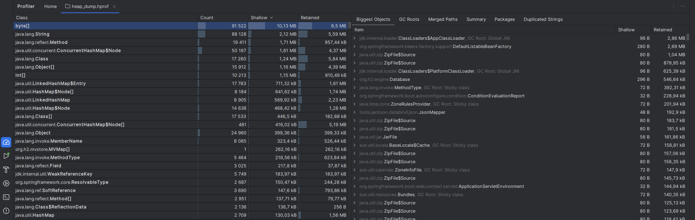
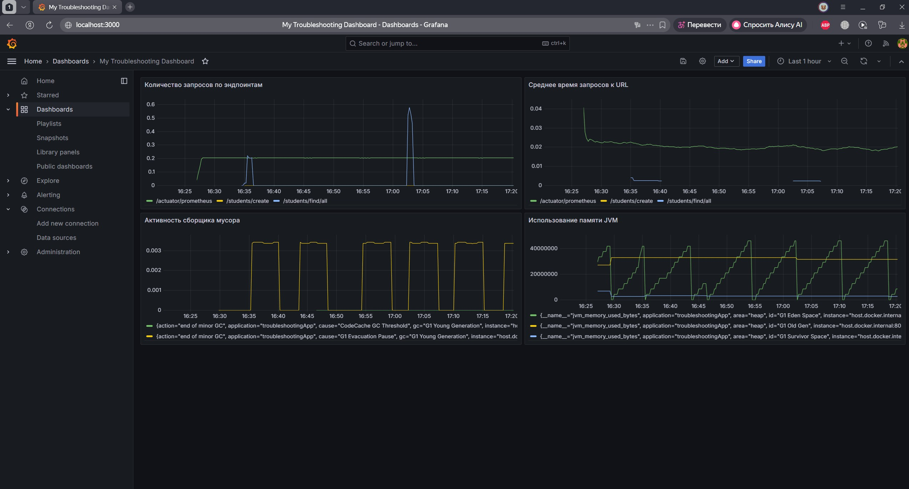
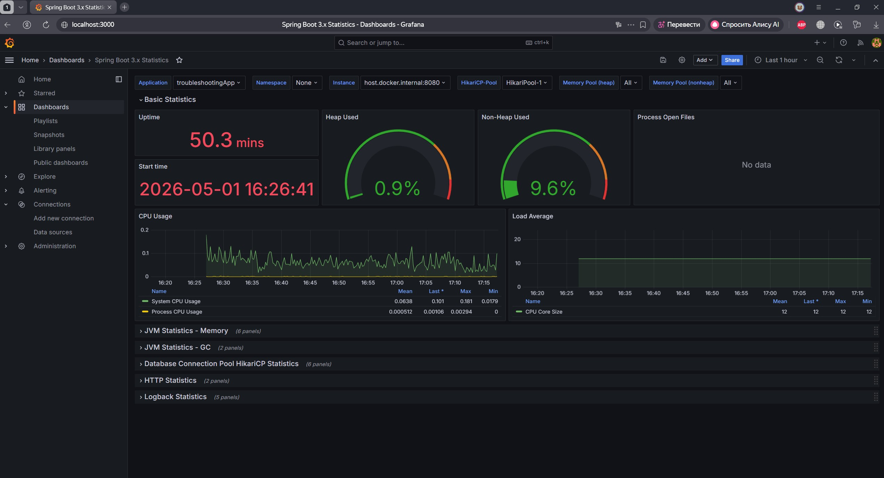

# Домашнее задание к лекции "Общее: Решение типовых проблем Java разработки: конвеншены, гит/битбакет, логирование"

# Задание 1
Создал простой CRUD сервис для манипуляций с сущностью Student \
В методе create добавил цикл, чтобы он выполнялся подольше \
В файле Testing.postman_collection.json содержаться запросы для Postman, их можно импортировать и использовать для проверки

# Задание 2
В файле thread_dump.txt хранится дамп для потоков, который я получил с помощью jstack (jstack номер_потока > thread_dump.txt ) \
В файле heap_dump.hprof хранится дамп памяти, который я получил с помощью jmap (jmap -dump:live,format=b,file=heap_dump.hprof номер_потока) 

## Отчёт по дампу потоков
Первые 10 потоков

| Название потока | Elapsed (сек) | CPU (ms) | % Нагрузки | Состояние/Назначение |
|---|---|---|---|---|
| DestroyJavaVM | 43.35 | 375.00 | 0.8651% | RUNNABLE |
| C1 CompilerThread0 | 46.00 | 375.00 | 0.8152% | RUNNABLE |
| File Watcher | 43.42 | 93.75 | 0.2159% | RUNNABLE |
| RMI TCP Connection(idle) | 43.31 | 46.88 | 0.1082% | RUNNABLE |
| RMI TCP Connection(5)-172.23.32.1 | 43.25 | 15.62 | 0.0361% | RUNNABLE |
| RMI TCP Connection(idle) | 43.31 | 15.62 | 0.0361% | RUNNABLE |
| http-nio-8080-Poller | 43.36 | 15.62 | 0.0360% | RUNNABLE |
| Catalina-utility-1 | 44.63 | 15.62 | 0.0350% | RUNNABLE |
| RMI TCP Connection(idle) | 44.84 | 15.62 | 0.0348% | RUNNABLE |
| G1 Conc#2 | 45.30 | 15.62 | 0.0345% | RUNNABLE |

## Отчет по дампу памяти
Если открыть файл heap_dump.hprof в IDE можно увидеть следующее:

# Задание 3
Логи прописаны в файле StudentRepository

# Задание 4 
Все файлы лежат в папке dashboards
## Скриншоты
Мой кастомный dashboard (My Troubleshooting Dashboard.json)

Dashboard со статистикой Spring-boot 3 (Spring-boot 3 statistics dashboard.json)

## Запросы PromQL
| Запрос                                                                                                                                                                                    | Метрика                           |
|-------------------------------------------------------------------------------------------------------------------------------------------------------------------------------------------|-----------------------------------|
| sum by(uri) (rate(http_server_requests_seconds_count{application="troubleshootingApp"}[1m]))                                                                                              | Количество запросов по эндпоинтам |
| jvm_memory_used_bytes{application="troubleshootingApp", area="heap"}                                                                                                                      | Использование памяти JVM          |
| sum by(uri) (rate(http_server_requests_seconds_sum{application="troubleshootingApp"}[5m])) / sum by(uri) (rate(http_server_requests_seconds_count{application="troubleshootingApp"}[5m])) | Среднее время запросов к URL      |
| rate(jvm_gc_pause_seconds_count[5m])                                                                                                                                                      | Активность сборщика мусора        |

# Задание 5